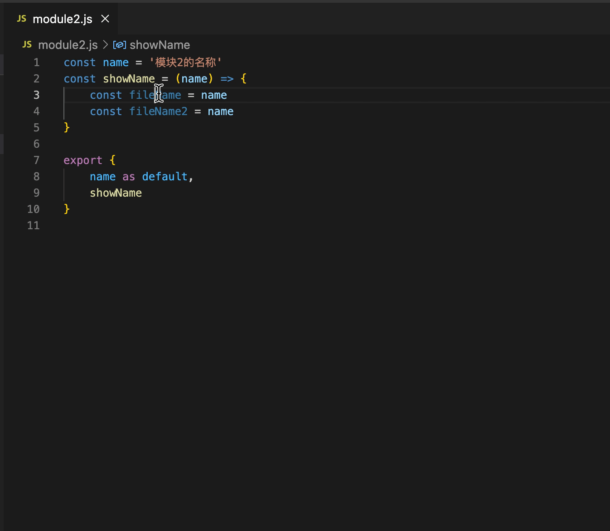

# zb-extensions

```
some extensions for visual studio code
```

[](https://marketplace.visualstudio.com/items?itemName=zhubo.zb-extensions)
[](https://marketplace.visualstudio.com/items?itemName=zhubo.zb-extensions)




--------------------------------------

##### 2022/07/16 (1.0.1)
* updated more description and fixed some snippets

##### 2022/07/16 (1.0.0)
* Frist version to try use

--------------------------------------
#### 开发VsCode插件流程 ####
```
// 一个插件必须在该属性中描述的什么条件下被激活
// contributes: 设置激活命令执行, #number 都是在这个属性里面配置的
activationEvents: []

// 可以是一直激活
1. ["*"]
// 可以是插件命令激活
2. [onComand:xx1]
#2. commands: [{ command: 'xx1' }]
// 可以是按键激活
3. [onComand:xx2]
#3. keybindings: [{ command: 'xx2, key: 'ctrl+shift+l', mac: 'ctrl+shift+l' }]

// 主要JavaScript代码位置
main: "extension.js"
```

--------------------------------------
#### contributes ####
```
* configuration:   设置，配置一些全局变量
* commands:        命令
* menus:           菜单/'右键菜单', '右上角图标', '资源管理器右键菜单'
* keybindings:     快捷键绑定
* themes:          主题
* snippets:        代码片段
* views:           左侧侧边栏内, view的实现
* viewsContainers: 自定义activityBar, '左侧侧边栏最大的图标'
```
